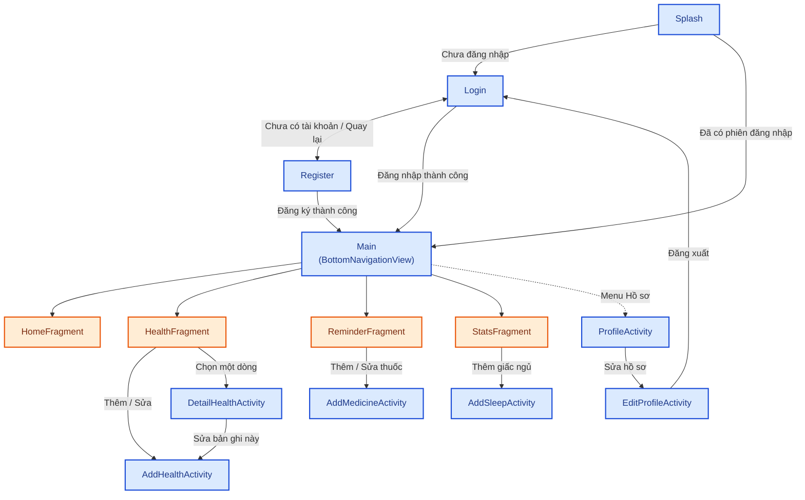
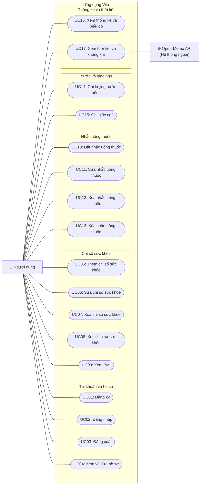

# VITA – ỨNG DỤNG ANDROID QUẢN LÝ SỨC KHỎE TẠI NHÀ

## TÀI LIỆU PHÂN TÍCH VÀ ĐẶC TẢ ĐỀ TÀI (PHIÊN BẢN CHÍNH THỨC)

- **Học phần:** Phát triển ứng dụng di động (LING189) và Thực hành (LING301) – Đồ án môn học
- **Đơn vị đào tạo:** Khoa Kỹ thuật – Công nghệ / Viện Công nghệ số, Trường Đại học Thủ Dầu Một
- **Giảng viên hướng dẫn:** ThS. Nguyễn Kim Duy
- **Sinh viên thực hiện:**
  1. Huỳnh Trung Tín (Leader, Database Developer, Core Android Developer) – Đóng góp: 50%
  2. Đinh Tấn Minh (UI/UX Developer, Reporter, Presenter) – Đóng góp: 50%
- **Chuẩn mẫu báo cáo:** Mẫu báo cáo đồ án học phần đặc thù (Mẫu ver2 của ThS. Nguyễn Kim Duy)
- **Kiến trúc mã nguồn:** Classic Pragmatic MVC (Phân tầng tinh gọn, loại bỏ boilerplate thừa theo triết lý Ponytail)
- **Package name:** `vn.edu.tdmu.vita`

---

## 1. Tổng quan đề tài và Định vị thương hiệu

### 1.1. Thông tin chung
* **Tên đề tài:** Xây dựng ứng dụng Android quản lý sức khỏe tại nhà Vita.
* **Tên thương hiệu:** **Vita** (Xuất phát từ tiếng Latinh mang ý nghĩa *Sự sống, sức sống, nguồn năng lượng tươi trẻ*).
* **Khẩu hiệu (Slogan):** *"Sức sống mỗi ngày, an tâm tại nhà"* (English: *"Healthy Living, Right at Home"*).

### 1.2. Mục tiêu đề tài
* Ghi nhận và theo dõi các chỉ số sinh hiệu sức khỏe hàng ngày: cân nặng, huyết áp, nhịp tim, đường huyết.
* Lập lịch báo thức nhắc uống thuốc đúng giờ, tích hợp nút xác nhận tương tác trực tiếp ("Đã uống" / "Bỏ qua") ngay trên thanh thông báo.
* Nhắc nhở uống nước định kỳ, tự động điều chỉnh mục tiêu nước dựa trên nhiệt độ thời tiết và chất lượng không khí (gọi Open-Meteo REST API).
* Ghi nhận giấc ngủ (xử lý logic qua nửa đêm) và trực quan hóa xu hướng sức khỏe bằng biểu đồ MPAndroidChart.
* Lưu trữ dữ liệu hoàn toàn cục bộ (Offline-First) bằng SQLite, bảo mật an toàn, tôn trọng quyền riêng tư người dùng.

### 1.3. Đối tượng và Phạm vi
* **Đối tượng sử dụng:** Người quan tâm chăm sóc sức khỏe chủ động, người lớn tuổi, bệnh nhân mắc bệnh lý mạn tính cần theo dõi chỉ số định kỳ tại nhà.
* **Phạm vi kỹ thuật:** Ứng dụng Android Native viết bằng Java; toàn bộ dữ liệu lưu trữ SQLite cục bộ trên máy, **không duy trì máy chủ riêng và không cần tài khoản quản trị web**. Chỉ gọi một REST API công khai duy nhất (Open-Meteo) để lấy thông tin khí tượng dựa trên tọa độ tỉnh/thành phố cố định (không yêu cầu quyền truy cập GPS).

### 1.4. Lý do chọn đề tài
* Nhu cầu tự theo dõi sức khỏe tại nhà ngày càng trở nên cấp thiết và phổ biến trong cộng đồng.
* Bao phủ trọn vẹn 100% các nội dung trọng tâm trong đề cương môn học LING189 & LING301: Activity/Intent, Fragment, BottomNavigationView, Custom RecyclerView Adapter, Context Menu, BroadcastReceiver, AlarmManager, NotificationChannel, SQLite, SharedPreferences, JSON Parser, HttpURLConnection và Đa luồng (ExecutorService + Handler).
* Khả năng demo trực quan, kết quả hiển thị sinh động (thông báo nổi, tương tác nút bấm, biểu đồ xu hướng nhiều màu sắc).

### 1.5. Ba điểm nhấn kỹ thuật then chốt
1. **Nhắc thuốc có xác nhận:** Thông báo Notification tích hợp 2 Action Buttons "Đã uống" và "Bỏ qua", kết quả tự động ghi nhận vào CSDL SQLite; cơ chế tự phục hồi báo thức sau khi khởi động lại máy (`BOOT_COMPLETED`).
2. **Gợi ý bù nước theo thời tiết thực tế:** Gọi Open-Meteo API, bóc tách JSON trên Worker Thread (`ExecutorService`), tự động tăng mục tiêu nước khi trời nắng nóng và có bộ nhớ đệm ngoại tuyến (Offline Cache).
3. **Biểu đồ xu hướng đa trục từ SQLite:** Vẽ biểu đồ đường song song 2 chỉ số huyết áp (Tâm thu / Tâm trương) và biểu đồ cột lượng nước/giấc ngủ bằng thư viện MPAndroidChart.

### 1.6. Nhận diện thương hiệu & Bảng màu chuẩn (Material Design 3)
* **Vita Teal (`#00897B`):** Màu chủ đạo (Primary) – Tượng trưng cho y tế, cân bằng, sự phục hồi sinh học. Dùng cho Toolbar, Button CTA, Tab active.
* **Sky Aqua (`#00ACC1`):** Màu phụ (Secondary) – Tượng trưng cho sự thanh lọc, công nghệ nhẹ nhàng. Dùng cho nút nổi FAB, thanh tiến độ nước.
* **Surface / Nền (`#F8F9FA` / `#FFFFFF`):** Nền dịu mắt, thẻ CardView bo góc 12dp, độ tương phản chữ đạt chuẩn WCAG AAA.
* **Semantic Colors:** Xanh lá (`#2E7D32` - Chuẩn), Vàng cam (`#F57C00` - Chú ý), Đỏ san hô (`#D32F2F` - Nguy cơ).
* **Biểu tượng (App Icon):** Chữ "V" cách điệu kết hợp chiếc lá mầm xanh và đường sóng xung nhịp tim/giọt nước.

---

## 2. Danh mục 10 Chức năng nghiệp vụ

| STT | Chức năng | Mô tả tóm tắt | Thành phần kỹ thuật chính |
| :---: | :--- | :--- | :--- |
| **1** | Đăng ký / Đăng nhập | Tạo tài khoản, kiểm tra trùng lặp, băm mật khẩu bảo mật, lưu phiên | SQLite, SharedPreferences, SHA-256 + salt |
| **2** | Hồ sơ cá nhân | Xem/sửa thông tin, chiều cao, mục tiêu nước, chọn chuẩn BMI Á/Quốc tế | SQLite (UserDao), Intent |
| **3** | Chỉ số sức khỏe | Thêm, sửa, xóa bản ghi sinh hiệu; hỗ trợ bỏ trống chỉ số (lưu NULL) | SQLite, DatePicker, RecyclerView, Context Menu |
| **4** | Lịch sử sức khỏe | Danh sách theo ngày giảm dần, lọc theo khoảng ngày, xem chi tiết | RecyclerView, truy vấn SQL có điều kiện |
| **5** | Tính BMI tự động | Tính từ cân nặng mới nhất, phân loại ngưỡng Á/WHO kèm màu cảnh báo | BMICalculator, logic Java thuần |
| **6** | Lập lịch nhắc thuốc | Đặt thuốc, liều lượng, giờ, ngày lặp lại; thông báo có nút xác nhận | AlarmManager, BroadcastReceiver, NotificationChannel |
| **7** | Theo dõi uống nước | Mục tiêu mặc định 2000 ml, nút nạp "+250 ml", thanh tiến độ ProgressBar | SQLite, AlarmManager nhắc mỗi 2h, ProgressBar |
| **8** | Ghi nhận giấc ngủ | Nhập giờ ngủ và thức (TimePicker), tự xử lý cộng 24h khi ngủ qua nửa đêm | TimePicker, SQLite (SleepDao) |
| **9** | Thống kê và biểu đồ | LineChart (cân nặng, huyết áp, tim), BarChart (ngủ, nước) theo tuần/tháng | MPAndroidChart, Cursor Data Pipeline |
| **10**| Thời tiết & AQI (API)| Thu thập nhiệt độ, độ ẩm, AQI từ Open-Meteo; áp dụng gợi ý bù nước | HttpURLConnection, JSONObject, ExecutorService |

---

## 3. Kiến trúc hệ thống (Classic Pragmatic MVC)

Nhằm tối ưu hóa số lượng dòng code (triết lý Ponytail) và loại bỏ nguy cơ xung đột mã nguồn khi nhóm 2 sinh viên cùng đẩy mã nguồn lên Git, hệ thống được cấu trúc phân tầng rõ ràng dưới package `vn.edu.tdmu.vita`:

```text
vn.edu.tdmu.vita/
├── activities/                      # 10 Activity màn hình
│   ├── SplashActivity.java          # Điều phối phiên đăng nhập SharedPreferences
│   ├── LoginActivity.java           # Đăng nhập bằng tài khoản SQLite
│   ├── RegisterActivity.java        # Đăng ký tài khoản (sinh salt & hash SHA-256)
│   ├── MainActivity.java            # Host BottomNavigationView + Toolbar Menu
│   ├── ProfileActivity.java         # Xem thông tin người dùng & cấu hình chuẩn BMI
│   ├── EditProfileActivity.java     # Cập nhật thông tin cá nhân & nút Đăng xuất
│   ├── AddHealthActivity.java       # Form nhập/sửa chỉ số sức khỏe
│   ├── DetailHealthActivity.java    # Xem chi tiết một bản ghi chỉ số
│   ├── AddMedicineActivity.java     # Form thêm/sửa thông tin thuốc và lịch nhắc
│   └── AddSleepActivity.java        # Form nhập giờ ngủ/giờ thức
├── fragments/                       # 4 Fragment gắn vào MainActivity
│   ├── HomeFragment.java            # Tổng quan BMI, thời tiết & AQI, lời khuyên
│   ├── HealthFragment.java          # Lịch sử chỉ số theo ngày giảm dần (RecyclerView)
│   ├── ReminderFragment.java        # Danh sách thuốc & tiến độ nước uống
│   └── StatsFragment.java           # Biểu đồ xu hướng MPAndroidChart & giấc ngủ
├── adapters/                        # RecyclerView Adapters (Trọng tâm Chương 2)
│   ├── HealthRecordAdapter.java     # Adapter chỉ số sức khỏe + Context Menu Sửa/Xóa
│   ├── MedicineAdapter.java         # Adapter thuốc + Switch Bật/Tắt + Context Menu
│   └── SleepRecordAdapter.java      # Adapter danh sách giấc ngủ 7 ngày gần nhất
├── database/                        # Tầng CSDL SQLite thuần (Tách 5 DAO độc lập)
│   ├── DatabaseHelper.java          # Tạo 6 bảng, PRAGMA foreign_keys = ON, Index
│   ├── UserDao.java                 # Quản lý tài khoản và hồ sơ (Huỳnh Trung Tín)
│   ├── HealthDao.java                # Quản lý bản ghi chỉ số đo (Đinh Tấn Minh)
│   ├── MedicineDao.java              # Quản lý danh mục thuốc và lịch nhắc (Huỳnh Trung Tín)
│   ├── WaterDao.java                 # Quản lý nhật ký nước uống (Huỳnh Trung Tín)
│   └── SleepDao.java                 # Quản lý nhật ký giấc ngủ (Đinh Tấn Minh)
├── models/                          # POJO Models map trực tiếp từ Cursor
│   ├── User.java, HealthRecord.java, Medicine.java
│   ├── MedicineLog.java, WaterLog.java, SleepLog.java, WeatherData.java
├── network/                         # Gọi API Open-Meteo
│   └── WeatherClient.java           # HttpURLConnection + ExecutorService + Handler
├── receivers/                       # Xử lý sự kiện hệ thống & báo thức
│   ├── MedicineAlarmReceiver.java   # Bắn Notification khi tới giờ uống thuốc
│   ├── NotificationActionReceiver.java # Tiếp nhận click "Đã uống" / "Bỏ qua"
│   └── BootReceiver.java            # Khôi phục báo thức khi thiết bị khởi động lại
└── utils/                           # Tiện ích dùng chung
    ├── SessionManager.java          # Đọc/ghi user_id vào SharedPreferences
    ├── BMICalculator.java           # Công thức tính & phân loại ngưỡng WHO/Châu Á
    ├── NotificationHelper.java      # Quản lý NotificationChannel
    └── DateTimeUtils.java           # Format ngày yyyy-MM-dd và giờ HH:mm
```

---

## 4. Thiết kế Cơ sở dữ liệu SQLite (6 Bảng chuẩn 3NF)

* **Tệp CSDL:** `vita_health.db`
* **Quy ước toàn vẹn:** Kích hoạt ràng buộc khóa ngoại bằng `PRAGMA foreign_keys = ON;`. Bật quy tắc xóa theo tầng `ON DELETE CASCADE` trên tất cả các khóa ngoại.
* **Tối ưu hóa (Index):** Tạo Composite Index trên `(user_id, date)` cho 3 bảng nhật ký thường xuyên truy vấn: `health_records`, `water_logs`, `sleep_logs`.

### Chi tiết cấu trúc các bảng:
1. **users:** `id` (INTEGER PK AUTOINCREMENT), `username` (TEXT UNIQUE NOT NULL), `password_hash` (TEXT NOT NULL), `salt` (TEXT NOT NULL), `fullname` (TEXT), `birth_year` (INTEGER), `gender` (TEXT), `height_cm` (REAL), `base_weight_kg` (REAL), `water_goal_ml` (INTEGER DEFAULT 2000), `bmi_standard` (TEXT DEFAULT 'ASIAN').
2. **health_records:** `id` (INTEGER PK AUTOINCREMENT), `user_id` (INTEGER FK → users.id), `date` (TEXT yyyy-MM-dd), `weight_kg` (REAL), `systolic` (INTEGER), `diastolic` (INTEGER), `heart_rate` (INTEGER), `blood_sugar` (REAL), `note` (TEXT). *(Các chỉ số cho phép NULL nếu không đo)*.
3. **medicines:** `id` (INTEGER PK AUTOINCREMENT, dùng làm `requestCode`), `user_id` (INTEGER FK → users.id), `name` (TEXT NOT NULL), `dosage` (TEXT), `time` (TEXT HH:mm), `days_mask` (INTEGER DEFAULT 127 - bitmask 7 ngày), `is_active` (INTEGER DEFAULT 1).
4. **medicine_logs:** `id` (INTEGER PK AUTOINCREMENT), `medicine_id` (INTEGER FK → medicines.id), `date` (TEXT yyyy-MM-dd), `status` (TEXT 'TAKEN'/'SKIPPED'), `logged_at` (TEXT yyyy-MM-dd HH:mm). *(Không lưu user_id để tuân thủ dạng chuẩn 3 3NF)*.
5. **water_logs:** `id` (INTEGER PK AUTOINCREMENT), `user_id` (INTEGER FK → users.id), `date` (TEXT yyyy-MM-dd), `amount_ml` (INTEGER NOT NULL), `logged_at` (TEXT yyyy-MM-dd HH:mm).
6. **sleep_logs:** `id` (INTEGER PK AUTOINCREMENT), `user_id` (INTEGER FK → users.id), `date` (TEXT yyyy-MM-dd - ngày thức), `sleep_time` (TEXT HH:mm), `wake_time` (TEXT HH:mm), `duration_h` (REAL NOT NULL).

---

## 5. Danh mục 14 Màn hình và Sơ đồ điều hướng



---

## 6. Sơ đồ Use Case tổng thể (17 Use Cases)



---

## 7. Phân công vai trò & Kế hoạch 4 tuần

### 7.1. Phân công 5 vai trò theo Mẫu của Thầy Duy (Nhóm 2 người)
| STT | Họ và tên | Vai trò đảm nhiệm | Nhiệm vụ chính phụ trách | Đóng góp |
| :---: | :--- | :--- | :--- | :---: |
| **1** | **Huỳnh Trung Tín** | • Leader<br>• Database Developer<br>• Android Developer (Core) | • Quản lý tiến độ dự án và phân chia công việc.<br>• Thiết kế và hiện thực CSDL SQLite (6 bảng), tối ưu Index.<br>• Lập trình xác thực tài khoản (SHA-256 + salt, SessionManager).<br>• Hiện thực cơ chế báo thức (AlarmManager, BroadcastReceiver).<br>• Xử lý đa luồng gọi REST API Open-Meteo (WeatherClient). | **50%** |
| **2** | **Đinh Tấn Minh** | • Android Developer (UI/UX)<br>• Reporter<br>• Presenter | • Thiết kế giao diện XML chuẩn Material Design 3 (14 màn hình).<br>• Hiện thực RecyclerView Adapters, Context Menu (Sửa/Xóa).<br>• Tích hợp thư viện MPAndroidChart vẽ biểu đồ xu hướng.<br>• Lập trình tính toán BMI và xử lý logic giờ ngủ.<br>• Soạn thảo báo cáo Word đồ án và trình bày thuyết trình (Demo). | **50%** |

### 7.2. Lộ trình thực hiện 4 tuần (Code song song viết báo cáo)
* **Tuần 1:** Thiết kế 6 bảng SQLite, viết `UserDao`, Splash/Login/Register, khung `MainActivity` (BottomNav). Hoàn thiện Báo cáo Chương 1.
* **Tuần 2:** Lập trình `HealthDao`, `MedicineDao`, `WaterDao`, hoàn thiện `HealthFragment` (RecyclerView), `ReminderFragment`, `BMICalculator`. Viết dự thảo Báo cáo Chương 2 (Chuyên đề RecyclerView + CardView + ContextMenu).
* **Tuần 3:** Hoàn thiện `AlarmManager`, `NotificationActionReceiver`, `BootReceiver`, `WeatherClient` (Open-Meteo) và `MPAndroidChart` (LineChart & BarChart). Soạn thảo Báo cáo Chương 3.
* **Tuần 4:** Kiểm thử toàn diện trên máy ảo & máy thật, đóng gói file `Vita.apk`, hoàn thiện toàn bộ file Word báo cáo theo Mẫu ver2, chuẩn bị slide thuyết trình bảo vệ đồ án.

---

## 8. Cấu trúc Báo cáo Đồ án (Chuẩn Mẫu ver2 của ThS. Nguyễn Kim Duy)

```text
TRANG BÌA (Theo mẫu chuẩn ĐH Thủ Dầu Một)
TRANG NHẬN XÉT VÀ CHẤM ĐIỂM CỦA GIẢNG VIÊN (ThS. Nguyễn Kim Duy)
MỤC LỤC / DANH MỤC HÌNH / DANH MỤC BẢNG / DANH MỤC TỪ VIẾT TẮT
MỞ ĐẦU (≤ 1 trang)
CHƯƠNG 1. MÔ TẢ BÀI TOÁN VÀ SƠ ĐỒ CHỨC NĂNG
  1.1 Mô tả bài toán (Hiện trạng, Mục tiêu, Phạm vi)
  1.2 Các chức năng của ứng dụng (Mô tả bằng lời 10 chức năng)
  1.3 Sơ đồ chức năng (Use Case Diagram & Bảng 1.1)
  1.4 Thiết kế giao diện và sơ đồ liên kết màn hình (Bảng 1.2 & Hình 1.2)
  1.5 Thiết kế cơ sở dữ liệu (ERD 6 bảng SQLite, Bảng 1.3 đến 1.8)
  1.6 Vai trò các thành viên (Bảng phân công 5 vai trò)
CHƯƠNG 2. TỔNG QUAN LÝ THUYẾT WIDGET TRONG ANDROID
  2.1 Tổng quan về RecyclerView và CardView trong kiến trúc giao diện Android
  2.2 Cơ chế tái sử dụng View (ViewHolder Pattern) và Adapter
  2.3 Kỹ thuật xử lý sự kiện tương tác nâng cao với Context Menu (Sửa/Xóa)
  2.4 So sánh hiệu năng giữa RecyclerView và ListView truyền thống
CHƯƠNG 3. HIỆN THỰC CHỨC NĂNG CÁC MÀN HÌNH VÀ DEMO ỨNG DỤNG
  3.1 Môi trường cài đặt và cấu trúc mã nguồn dự án
  3.2 Hiện thực chi tiết các phân hệ cốt lõi (Mã nguồn tiêu biểu & Giải thích)
  3.3 Kết quả thực nghiệm và ảnh chụp minh chứng 14 màn hình ứng dụng
  3.4 Đánh giá kết quả kiểm thử (Test Matrix)
KẾT LUẬN VÀ HƯỚNG PHÁT TRIỂN
TÀI LIỆU THAM KHẢO (Định dạng chuẩn IEEE)
PHỤ LỤC (Hướng dẫn cài đặt file APK trên thiết bị thật)
```

---

## 9. Bộ câu hỏi vấn đáp bảo vệ đồ án (Chuẩn bị trước)

1. **Vì sao gọi API mạng trên luồng phụ thay vì Main Thread?**  
   *Trả lời:* Từ Android 3.0, gọi mạng trên Main Thread sẽ ném lỗi `NetworkOnMainThreadException` và gây đơ giao diện (ANR). Bắt buộc phải dùng luồng nền (Worker Thread qua `ExecutorService`) để thực thi kết nối, sau đó dùng `Handler(Looper.getMainLooper())` để trả dữ liệu về cập nhật giao diện.
2. **Vì sao dùng Alarm từng lần thay vì `setRepeating`?**  
   *Trả lời:* Kể từ Android 6.0 với chế độ Doze Mode, hệ điều hành gom nhóm và làm trễ các báo thức lập lại bằng `setRepeating()` để tiết kiệm pin. Uống thuốc đòi hỏi giờ chính xác nên ứng dụng dùng `setExactAndAllowWhileIdle()` để kích hoạt đúng giờ ngay cả khi máy ngủ sâu, sau đó tự đặt lại cho ngày tiếp theo.
3. **Điều gì xảy ra với Alarm sau khi khởi động lại máy?**  
   *Trả lời:* Toàn bộ báo thức trong RAM bị xóa sạch. Ứng dụng đăng ký `BootReceiver` đón sự kiện `ACTION_BOOT_COMPLETED` để tự động truy vấn SQLite và lập lịch lại các thuốc đang bật (`is_active = 1`).
4. **Tại sao mật khẩu băm SHA-256 cần thêm chuỗi Salt?**  
   *Trả lời:* Mật khẩu là dữ liệu nhạy cảm không được lưu chuỗi thô. Băm SHA-256 kết hợp chuỗi salt ngẫu nhiên giúp ngăn chặn hoàn toàn tấn công tra cứu bảng băm tính sẵn (Rainbow Table Attack).
5. **Vì sao bảng `medicine_logs` không lưu trường `user_id`?**  
   *Trả lời:* Nhằm tuân thủ dạng chuẩn 3 (3NF) để tránh dư thừa dữ liệu, vì `medicine_id` đã xác định duy nhất đơn thuốc và người dùng. Khi cần truy vấn lịch sử theo người dùng, ứng dụng thực hiện phép `INNER JOIN` với bảng `medicines`.

---

## 10. Ponytail Debt & YAGNI Ledger (Các thành phần đã tinh giản)
* `ponytail:skip-cloud-server`: Loại bỏ máy chủ đám mây; dữ liệu hoàn toàn lưu SQLite cục bộ.
* `ponytail:skip-gps-permission`: Không xin quyền GPS nhạy cảm; chọn thành phố cố định qua Spinner tọa độ.
* `ponytail:skip-room-retrofit`: Không cài thư viện Room/Retrofit nặng nề; sử dụng `SQLiteOpenHelper` và `HttpURLConnection` chuẩn gốc Android bám sát đề cương.
* `ponytail:skip-viewbinding`: Sử dụng `findViewById` truyền thống để khớp 100% các bài thực hành phòng máy của môn học.
